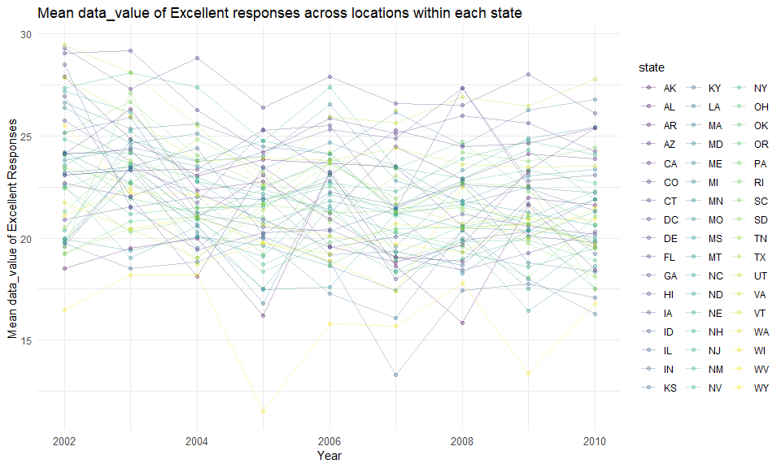
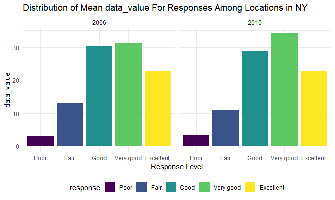
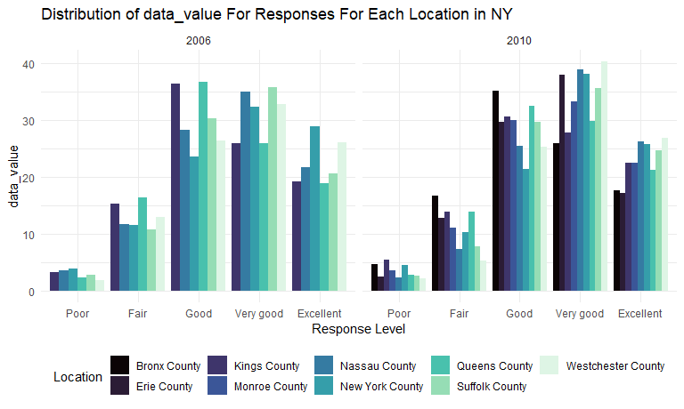
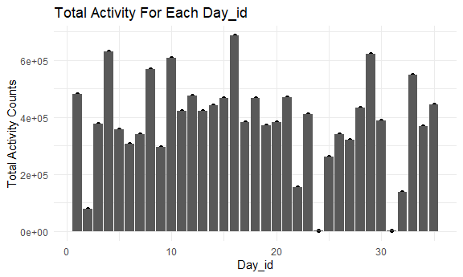
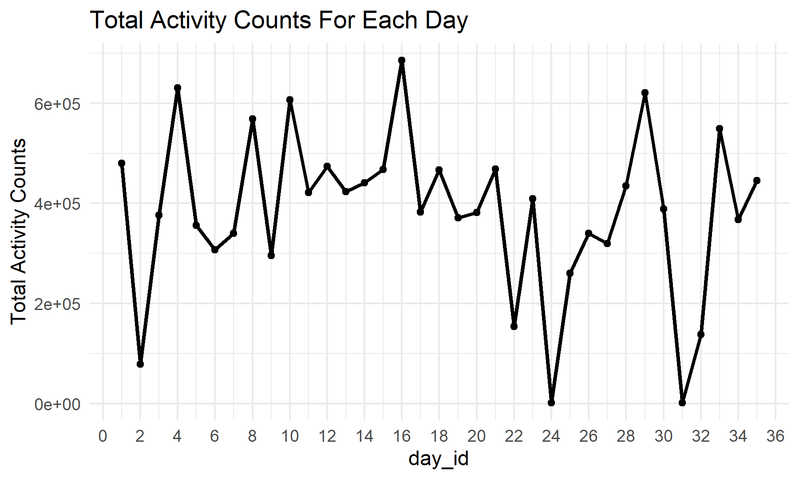

p8105\_hw2\_wz2590
================
Weiheng Zhang

``` r
library(tidyverse)
```

    ## -- Attaching packages --------------------------------------- tidyverse 1.3.1 --

    ## v ggplot2 3.3.5     v purrr   0.3.4
    ## v tibble  3.1.4     v dplyr   1.0.7
    ## v tidyr   1.1.3     v stringr 1.4.0
    ## v readr   2.0.1     v forcats 0.5.1

    ## -- Conflicts ------------------------------------------ tidyverse_conflicts() --
    ## x dplyr::filter() masks stats::filter()
    ## x dplyr::lag()    masks stats::lag()

``` r
library(dplyr)
library(p8105.datasets)

knitr::opts_chunk$set(
  fig.width = 6,
  fig.asp = .6,
  out.width = "90%"
)

theme_set(theme_minimal() + theme(legend.position = "bottom"))

options(
  ggplot2.continuous.colour = "viridis",
  ggplot2.continuous.fill = "viridis"
)

scale_colour_discrete = scale_color_viridis_d
scale_fill_discrete = scale_fill_viridis_d
```

## Problem 1

Instacart is an online grocery service that allows people in NYC to shop
online from local stores. The “instacart” dataset contains contains
1,384,617 observations, where each observation represents a product from
an order. There are 15 variables for each observation:  
order\_id: order identifier product\_id: product identifier
add\_to\_cart\_order: order in which each product was added to cart
reordered: 1 if this prodcut has been ordered by this user in the past,
0 otherwise user\_id: customer identifier eval\_set: which evaluation
set this order belongs in (Note that the data for use in this class is
exclusively from the “train” eval\_set) order\_number: the order
sequence number for this user (1=first, n=nth) order\_dow: the day of
the week on which the order was placed order\_hour\_of\_day: the hour of
the day on which the order was placed days\_since\_prior\_order: days
since the last order, capped at 30, NA if order\_number=1 product\_name:
name of the product aisle\_id: aisle identifier department\_id:
department identifier aisle: the name of the aisle department: the name
of the department

The key variable we will use for the following analysis is “aisle”.

``` r
data("instacart")
```

How many aisles are there, and which aisles are the most items ordered
from?

``` r
instacart %>% 
  count(aisle) %>% 
  arrange(desc(n)) %>% 
  rename(count = n)
```

    ## # A tibble: 134 x 2
    ##    aisle                          count
    ##    <chr>                          <int>
    ##  1 fresh vegetables              150609
    ##  2 fresh fruits                  150473
    ##  3 packaged vegetables fruits     78493
    ##  4 yogurt                         55240
    ##  5 packaged cheese                41699
    ##  6 water seltzer sparkling water  36617
    ##  7 milk                           32644
    ##  8 chips pretzels                 31269
    ##  9 soy lactosefree                26240
    ## 10 bread                          23635
    ## # ... with 124 more rows

``` r
instacart %>% 
  count(aisle) %>% 
  rename(count = n) %>% 
  filter(count > 10000) %>% 
  mutate(
    aisle = factor(aisle),
    aisle = fct_reorder(aisle, count)
  ) %>% 
  ggplot(aes(x = count, y = aisle)) +
  geom_point() +
  scale_x_continuous(breaks = scales::pretty_breaks(n = 10)) +
  xlab("Number of Items") + ylab("Aisles") +
  labs(title = "Top 39 Aisles Number of Items Ordered For Each Aisle")
```


This is a table showing the three most popular items in each of the
aisles “baking ingredients”, “dog food care”, and “packaged vegetables
fruits”, Including the number of times each item is ordered.

``` r
instacart %>% 
  filter(aisle %in% c("baking ingredients", "dog food care", "packaged vegetables fruits")) %>% 
  group_by(aisle) %>% 
  count(product_name) %>% 
  rename(ordered_times = n) %>% 
  mutate(rank = min_rank(desc(ordered_times))) %>% 
  filter(rank < 4) %>% 
  arrange(aisle, rank) %>% 
  select(aisle, product_name, ordered_times) %>% 
  knitr::kable()
```

| aisle                      | product\_name                                 | ordered\_times |
|:---------------------------|:----------------------------------------------|---------------:|
| baking ingredients         | Light Brown Sugar                             |            499 |
| baking ingredients         | Pure Baking Soda                              |            387 |
| baking ingredients         | Cane Sugar                                    |            336 |
| dog food care              | Snack Sticks Chicken & Rice Recipe Dog Treats |             30 |
| dog food care              | Organix Chicken & Brown Rice Recipe           |             28 |
| dog food care              | Small Dog Biscuits                            |             26 |
| packaged vegetables fruits | Organic Baby Spinach                          |           9784 |
| packaged vegetables fruits | Organic Raspberries                           |           5546 |
| packaged vegetables fruits | Organic Blueberries                           |           4966 |

The following human-readable table shows the mean hour of the day at
which Pink Lady Apples and Coffee Ice Cream are ordered on each day of
the week.

``` r
instacart %>% 
  filter(product_name %in% c("Pink Lady Apples", "Coffee Ice Cream")) %>% 
  group_by(product_name, order_dow) %>% 
  summarise(mean_hour = mean(order_hour_of_day)) %>% 
  pivot_wider(
    names_from = order_dow,
    values_from = mean_hour
  ) %>% 
  knitr::kable()
```

    ## `summarise()` has grouped output by 'product_name'. You can override using the `.groups` argument.

| product\_name    |        0 |        1 |        2 |        3 |        4 |        5 |        6 |
|:-----------------|---------:|---------:|---------:|---------:|---------:|---------:|---------:|
| Coffee Ice Cream | 13.77419 | 14.31579 | 15.38095 | 15.31818 | 15.21739 | 12.26316 | 13.83333 |
| Pink Lady Apples | 13.44118 | 11.36000 | 11.70213 | 14.25000 | 11.55172 | 12.78431 | 11.93750 |

## Problem 2

``` r
library(p8105.datasets)
data("brfss_smart2010")
```

Behavioral Risk Factor Surveillance System (BRFSS) is a continuous,
state-based surveillance system that collects information about
modifiable risk factors for chronic diseases and other leading causes of
death. BRFSS data can be used to identify emerging health problems,
establish and track health objectives, and develop and evaluate public
health policies and programs.

The brfss\_smart2010 dataset contains 134,203 observations and 23
variables, from year 2002 to year 2010. There is information on
location, topic, question, response, and response number of each
observation. The data is structured so that each (multiple-choice)
response to each question is a separate row.

Data cleaning:  
Format the data to use appropriate variable names;  
Focus on the “Overall Health” topic;  
Include only responses from “Excellent” to “Poor”;  
Organize responses as a factor taking levels ordered from “Poor” to
“Excellent”.

``` r
brfss_clean = 
  brfss_smart2010 %>% 
  janitor::clean_names() %>% 
  filter(topic == "Overall Health") %>% 
  separate(locationdesc, into = c('state', 'location'), sep = ' - ') %>%
  mutate(response = factor(response, levels = c("Poor", "Fair", "Good", "Very good", "Excellent"))) %>%
  arrange(response) %>% 
  #filter(response == "Excellent"  | response == "Very good" | response == "Good" | response == "Fair" | response == "Poor") %>% 
  select(-locationabbr, -class, -topic,  -question, -c(confidence_limit_low:geo_location))

brfss_clean %>% view()
```

``` r
states_2002 = brfss_clean %>% 
  filter(year == "2002") %>% 
  group_by(state) %>% 
  distinct(location) %>% 
  count(state) %>% 
  filter(n >= 7)
states_2002
```

    ## # A tibble: 6 x 2
    ## # Groups:   state [6]
    ##   state     n
    ##   <chr> <int>
    ## 1 CT        7
    ## 2 FL        7
    ## 3 MA        8
    ## 4 NC        7
    ## 5 NJ        8
    ## 6 PA       10

``` r
states_2010 = brfss_clean %>% 
  filter(year == "2010") %>% 
  group_by(state) %>% 
  distinct(location) %>% 
  count(state) %>% 
  filter(n >= 7)
states_2010
```

    ## # A tibble: 14 x 2
    ## # Groups:   state [14]
    ##    state     n
    ##    <chr> <int>
    ##  1 CA       12
    ##  2 CO        7
    ##  3 FL       41
    ##  4 MA        9
    ##  5 MD       12
    ##  6 NC       12
    ##  7 NE       10
    ##  8 NJ       19
    ##  9 NY        9
    ## 10 OH        8
    ## 11 PA        7
    ## 12 SC        7
    ## 13 TX       16
    ## 14 WA       10

These states were observed at 7 or more locations in 2002: CT, FL, MA,
NC, NJ, PA  
In 2010: CA, CO, FL, MA, MD, NC, NE, NJ, NY, OH, PA, SC, TX, WA

Construct a dataset that is limited to Excellent responses, and
contains, year, state, and a variable that averages the data\_value
across locations within a state. Make a “spaghetti” plot of this average
value over time within a state (that is, make a plot showing a line for
each state across years – the geom\_line geometry and group aesthetic
will help).

viridis::scale\_color\_viridis( name = “State”, discrete = T )

``` r
topResponses_info = brfss_clean %>% 
  filter(response == "Excellent") %>% 
  group_by(state, year) %>% 
  summarise(mean_dataValue = mean(data_value, na.rm = T)) 
```

    ## `summarise()` has grouped output by 'state'. You can override using the `.groups` argument.

``` r
topResponses_info 
```

    ## # A tibble: 443 x 3
    ## # Groups:   state [51]
    ##    state  year mean_dataValue
    ##    <chr> <int>          <dbl>
    ##  1 AK     2002           27.9
    ##  2 AK     2003           24.8
    ##  3 AK     2004           23.0
    ##  4 AK     2005           23.8
    ##  5 AK     2007           23.5
    ##  6 AK     2008           20.6
    ##  7 AK     2009           23.2
    ##  8 AL     2002           18.5
    ##  9 AL     2003           19.5
    ## 10 AL     2004           20  
    ## # ... with 433 more rows

``` r
ggplot(topResponses_info, aes(x = year, y = mean_dataValue, color = state)) +
  geom_line(alpha = .3, aes(group = state, color = state)) +
  geom_point(alpha = .3, aes(group = state, color = state)) +
  xlab("Year") + ylab("Mean data_value of Excellent Responses") +
  labs(title = "Mean data_value of Excellent responses across locations within each state") +
  theme(axis.text.x = element_text(size = 10), legend.position = "right") 
```



Make a two-panel plot showing, for the years 2006, and 2010,
distribution of data\_value for responses (“Poor” to “Excellent”) among
locations in NY State.

``` r
brfss_dist = brfss_clean %>% 
  filter(year %in% c(2006,2010),
         state == "NY") %>% 
  group_by(year, response) %>% 
  summarise(mean_data_value = mean(data_value, na.rm = T))
```

    ## `summarise()` has grouped output by 'year'. You can override using the `.groups` argument.

``` r
brfss_dist
```

    ## # A tibble: 10 x 3
    ## # Groups:   year [2]
    ##     year response  mean_data_value
    ##    <int> <fct>               <dbl>
    ##  1  2006 Poor                 2.93
    ##  2  2006 Fair                13.1 
    ##  3  2006 Good                30.2 
    ##  4  2006 Very good           31.3 
    ##  5  2006 Excellent           22.5 
    ##  6  2010 Poor                 3.39
    ##  7  2010 Fair                11.0 
    ##  8  2010 Good                28.8 
    ##  9  2010 Very good           34.1 
    ## 10  2010 Excellent           22.7

Histogram of mean data\_value across all locations in NY, for each
response level.

``` r
brfss_dist %>% 
    ggplot(aes(x = response, y = mean_data_value, fill = response)) + 
    geom_col(position = "dodge") + 
    labs(
        title = "Distribution of Mean data_value For Responses Among Locations in NY",
        x = "Response Level",
        y = "data_value") +
    facet_grid(. ~ year)
```



Histogram of data\_value, seperated for each location, for each response
level.

``` r
brfss_clean %>% 
    mutate(location = str_to_title(location)) %>% 
    filter(
        year %in% c(2006, 2010),
        state == "NY") %>% 
        group_by(year, location) %>%
    ggplot(aes(x = response, y = data_value, fill = location)) + 
    geom_col(position = "dodge") + 
    viridis::scale_fill_viridis(
      option = "mako",
      name = "Location",
      discrete = TRUE) +
    labs(
        title = "Distribution of data_value For Responses For Each Location in NY",
        x = "Response Level",
        y = "data_value") +
    facet_grid(. ~ year)
```



## Problem 3

``` r
accel_data = read_csv("./data/accel_data.csv")
```

    ## Rows: 35 Columns: 1443

    ## -- Column specification --------------------------------------------------------
    ## Delimiter: ","
    ## chr    (1): day
    ## dbl (1442): week, day_id, activity.1, activity.2, activity.3, activity.4, ac...

    ## 
    ## i Use `spec()` to retrieve the full column specification for this data.
    ## i Specify the column types or set `show_col_types = FALSE` to quiet this message.

The accel\_data contains five weeks of accelerator data collected on a
63 year-old male with BMI 25, who was admitted to the Advanced Cardiac
Care Center of Columbia University Medical Center and diagnosed with
congestive heart failure (CHF). The data can be downloaded here. In this
spreadsheet, variables activity.\* are the activity counts for each
minute of a 24-hour day starting at midnight.

Load, tidy, and wrangle the data. The accel\_data\_clean dataset
includes all originally observed variables and values; has useful
variable names; includes a weekday vs weekend variable; and encodes data
with reasonable variable classes.

``` r
accel_data_clean = accel_data %>% 
  pivot_longer(
    cols = activity.1:activity.1440,
    names_to = "activity_number",
    values_to = "activity_counts",
    names_prefix = "activity.",
  ) %>% 
  mutate(
    is_weekend = (day == "Saturday" | day == "Sunday")
    )
```

The accel\_data\_clean dataset contains 50400 observations and 6
variables.  
The variables records these information for each observation: week
count, day count, which day in a week, is it weekend or not, activity
number(id), and counts of activity.

Traditional analyses of accelerometer data focus on the total activity
over the day. Using the tidied dataset, we will aggregate accross
minutes to create a total activity variable for each day, and create a
table showing these totals.

``` r
total_activity = 
  accel_data_clean %>% 
  group_by(day_id) %>% 
  summarize(total_activity_counts = sum(activity_counts))

knitr::kable(total_activity)
```

| day\_id | total\_activity\_counts |
|--------:|------------------------:|
|       1 |               480542.62 |
|       2 |                78828.07 |
|       3 |               376254.00 |
|       4 |               631105.00 |
|       5 |               355923.64 |
|       6 |               307094.24 |
|       7 |               340115.01 |
|       8 |               568839.00 |
|       9 |               295431.00 |
|      10 |               607175.00 |
|      11 |               422018.00 |
|      12 |               474048.00 |
|      13 |               423245.00 |
|      14 |               440962.00 |
|      15 |               467420.00 |
|      16 |               685910.00 |
|      17 |               382928.00 |
|      18 |               467052.00 |
|      19 |               371230.00 |
|      20 |               381507.00 |
|      21 |               468869.00 |
|      22 |               154049.00 |
|      23 |               409450.00 |
|      24 |                 1440.00 |
|      25 |               260617.00 |
|      26 |               340291.00 |
|      27 |               319568.00 |
|      28 |               434460.00 |
|      29 |               620860.00 |
|      30 |               389080.00 |
|      31 |                 1440.00 |
|      32 |               138421.00 |
|      33 |               549658.00 |
|      34 |               367824.00 |
|      35 |               445366.00 |

``` r
ggplot(total_activity, aes(x = day_id, y = total_activity_counts))+
  geom_point() +
  geom_col(position = "dodge") +
  labs(
    title = "Total Activity For Each Day_id",
    x = "Day_id",
    y = "Total Activity Counts"
  )
```



As time passes day by day, the total activity counts are oscillating up
and down. Generally, after the 23th day, there are more days with total
activity counts less than 3.2e+0.5 comparing to the days before the 23th
day.

Accelerometer data allows the inspection activity over the course of the
day. Now we will make a single-panel plot that shows the 24-hour
activity time courses for each day and use color to indicate day of the
week.

``` r
accel_data_clean %>% 
  mutate(activity_number = as.numeric(activity_number)) %>% 
  group_by(day, activity_number) %>% 
  summarize(avg_value = mean(activity_counts)) %>% 
  ggplot(aes(x = activity_number, y = avg_value, color = day)) +
  geom_smooth(se=FALSE) +
  scale_x_discrete(limit = c(240,480,720,960,1200,1440), 
                   labels=c("4", "8", "12", "16", "20", "24")) +
  labs(
    title = "Average 24 Hour Activity Time Courses for Each Day of the Week",
    x = "Activity Number (hrs)",
    y = "Average Activity Counts",
    color = "Day of the Week"
  )
```

    ## `summarise()` has grouped output by 'day'. You can override using the `.groups` argument.

    ## Warning: Continuous limits supplied to discrete scale.
    ## Did you mean `limits = factor(...)` or `scale_*_continuous()`?

    ## `geom_smooth()` using method = 'gam' and formula 'y ~ s(x, bs = "cs")'



The average acticity counts for all days in a week are at lowest during
the time period of around 23:50 p.m. to 6:00 a.m, because at this period
the test subject is sleeping and cannot move around frequently. There
are also significant higher peak of average activity counts at around
10:30 a.m of Thurdsay and around 21:00 p.m of Friday. This is probably
because the test subject was doing some special activity (like doing
exercises).
