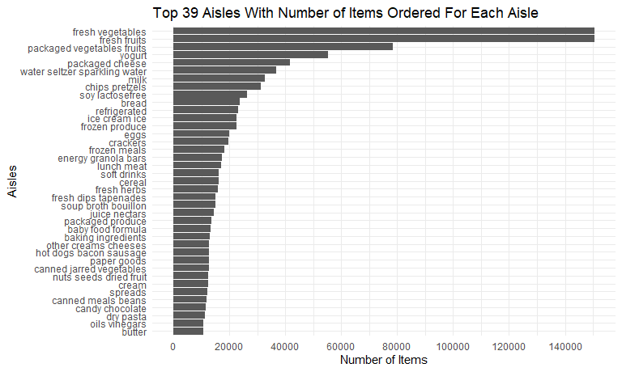

p8105\_hw2\_wz2590
================
Weiheng Zhang

``` r
library(tidyverse)
```

    ## -- Attaching packages --------------------------------------- tidyverse 1.3.1 --

    ## v ggplot2 3.3.5     v purrr   0.3.4
    ## v tibble  3.1.4     v dplyr   1.0.7
    ## v tidyr   1.1.3     v stringr 1.4.0
    ## v readr   2.0.1     v forcats 0.5.1

    ## -- Conflicts ------------------------------------------ tidyverse_conflicts() --
    ## x dplyr::filter() masks stats::filter()
    ## x dplyr::lag()    masks stats::lag()

``` r
library(dplyr)
library(p8105.datasets)

knitr::opts_chunk$set(
  fig.width = 6,
  fig.asp = .6,
  out.width = "90%"
)

theme_set(theme_minimal() + theme(legend.position = "bottom"))

options(
  ggplot2.continuous.colour = "viridis",
  ggplot2.continuous.fill = "viridis"
)

scale_colour_discrete = scale_color_viridis_d
scale_fill_discrete = scale_fill_viridis_d
```

## Problem 1

Instacart is an online grocery service that allows people in NYC to shop
online from local stores. The “instacart” dataset contains contains
1,384,617 observations, where each observation represents a product from
an order. There are 15 variables for each observation:  
order\_id: order identifier product\_id: product identifier
add\_to\_cart\_order: order in which each product was added to cart
reordered: 1 if this prodcut has been ordered by this user in the past,
0 otherwise user\_id: customer identifier eval\_set: which evaluation
set this order belongs in (Note that the data for use in this class is
exclusively from the “train” eval\_set) order\_number: the order
sequence number for this user (1=first, n=nth) order\_dow: the day of
the week on which the order was placed order\_hour\_of\_day: the hour of
the day on which the order was placed days\_since\_prior\_order: days
since the last order, capped at 30, NA if order\_number=1 product\_name:
name of the product aisle\_id: aisle identifier department\_id:
department identifier aisle: the name of the aisle department: the name
of the department

The key variable we will use for the following analysis is “aisle”.

``` r
data("instacart")
```

How many aisles are there, and which aisles are the most items ordered
from?

``` r
instacart %>% 
  count(aisle) %>% 
  arrange(desc(n)) %>% 
  rename(count = n)
```

    ## # A tibble: 134 x 2
    ##    aisle                          count
    ##    <chr>                          <int>
    ##  1 fresh vegetables              150609
    ##  2 fresh fruits                  150473
    ##  3 packaged vegetables fruits     78493
    ##  4 yogurt                         55240
    ##  5 packaged cheese                41699
    ##  6 water seltzer sparkling water  36617
    ##  7 milk                           32644
    ##  8 chips pretzels                 31269
    ##  9 soy lactosefree                26240
    ## 10 bread                          23635
    ## # ... with 124 more rows

``` r
instacart %>% 
  count(aisle) %>% 
  rename(count = n) %>% 
  filter(count > 10000) %>% 
  mutate(
    aisle = factor(aisle),
    aisle = fct_reorder(aisle, count)
  ) %>% 
  ggplot(aes(x = count, y = aisle)) +
  geom_point() +
  scale_x_continuous(breaks = scales::pretty_breaks(n = 10)) +
  xlab("Number of Items") + ylab("Aisles") +
  labs(title = "Top 39 Aisles Number of Items Ordered For Each")
```



This is a table showing the three most popular items in each of the
aisles “baking ingredients”, “dog food care”, and “packaged vegetables
fruits”, Including the number of times each item is ordered.

``` r
instacart %>% 
  filter(aisle %in% c("baking ingredients", "dog food care", "packaged vegetables fruits")) %>% 
  group_by(aisle) %>% 
  count(product_name) %>% 
  rename(ordered_times = n) %>% 
  mutate(rank = min_rank(desc(ordered_times))) %>% 
  filter(rank < 4) %>% 
  arrange(aisle, rank) %>% 
  knitr::kable()
```

| aisle                      | product\_name                                 | ordered\_times | rank |
|:---------------------------|:----------------------------------------------|---------------:|-----:|
| baking ingredients         | Light Brown Sugar                             |            499 |    1 |
| baking ingredients         | Pure Baking Soda                              |            387 |    2 |
| baking ingredients         | Cane Sugar                                    |            336 |    3 |
| dog food care              | Snack Sticks Chicken & Rice Recipe Dog Treats |             30 |    1 |
| dog food care              | Organix Chicken & Brown Rice Recipe           |             28 |    2 |
| dog food care              | Small Dog Biscuits                            |             26 |    3 |
| packaged vegetables fruits | Organic Baby Spinach                          |           9784 |    1 |
| packaged vegetables fruits | Organic Raspberries                           |           5546 |    2 |
| packaged vegetables fruits | Organic Blueberries                           |           4966 |    3 |

The following human-readable table shows the mean hour of the day at
which Pink Lady Apples and Coffee Ice Cream are ordered on each day of
the week.

``` r
instacart %>% 
  filter(product_name %in% c("Pink Lady Apples", "Coffee Ice Cream")) %>% 
  group_by(product_name, order_dow) %>% 
  summarise(mean_hour = mean(order_hour_of_day)) %>% 
  pivot_wider(
    names_from = order_dow,
    values_from = mean_hour
  ) %>% 
  knitr::kable()
```

    ## `summarise()` has grouped output by 'product_name'. You can override using the `.groups` argument.

| product\_name    |        0 |        1 |        2 |        3 |        4 |        5 |        6 |
|:-----------------|---------:|---------:|---------:|---------:|---------:|---------:|---------:|
| Coffee Ice Cream | 13.77419 | 14.31579 | 15.38095 | 15.31818 | 15.21739 | 12.26316 | 13.83333 |
| Pink Lady Apples | 13.44118 | 11.36000 | 11.70213 | 14.25000 | 11.55172 | 12.78431 | 11.93750 |
