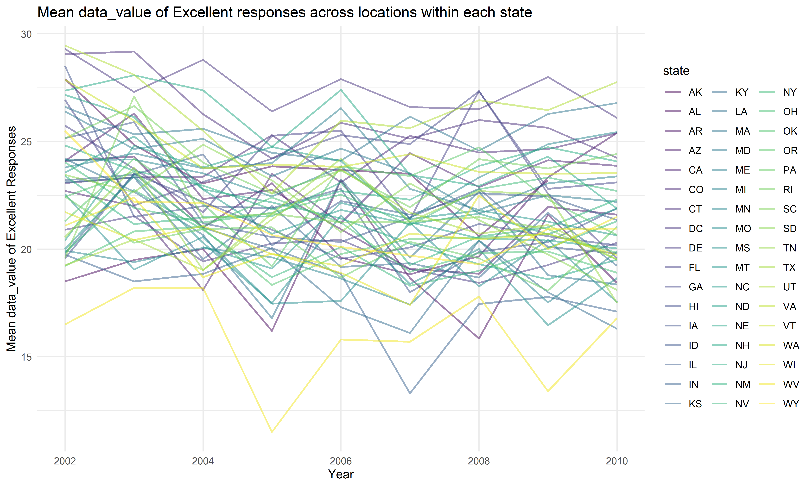
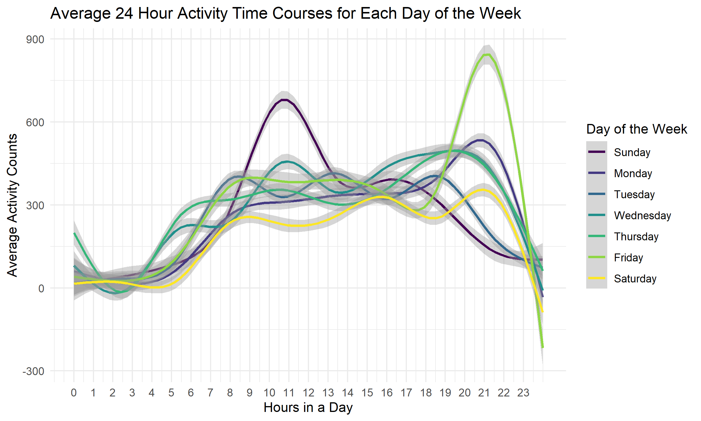

p8105\_hw3\_wz2590
================
Weiheng Zhang

``` r
library(tidyverse)
library(dplyr)
library(p8105.datasets)

knitr::opts_chunk$set(
  fig.width = 6,
  fig.asp = .6,
  out.width = "90%"
)

theme_set(theme_minimal() + theme(legend.position = "bottom"))

options(
  ggplot2.continuous.colour = "viridis",
  ggplot2.continuous.fill = "viridis"
)

scale_colour_discrete = scale_color_viridis_d
scale_fill_discrete = scale_fill_viridis_d
```

## Problem 1

``` r
data("instacart")
```

Instacart is an online grocery service that allows people in NYC to shop
online from local stores. The “instacart” dataset contains contains
1,384,617 observations, where each observation represents a product from
an order. There are 15 variables for each observation:  
order\_id: order identifier  
product\_id: product identifier  
add\_to\_cart\_order: order in which each product was added to cart  
reordered: 1 if this prodcut has been ordered by this user in the past,
0 otherwise  
user\_id: customer identifier  
eval\_set: which evaluation set this order belongs in  
order\_number: the order sequence number for this user (1=first,
n=nth)  
order\_dow: the day of the week on which the order was placed  
order\_hour\_of\_day: the hour of the day on which the order was
placed  
days\_since\_prior\_order: days since the last order, capped at 30, NA
if order\_number=1  
product\_name: name of the product  
aisle\_id: aisle identifier  
department\_id: department identifier  
aisle: the name of the aisle  
department: the name of the department

Some example observations:

``` r
instacart %>% 
  slice(c(1,26,85)) %>% 
  knitr::kable()
```

| order\_id | product\_id | add\_to\_cart\_order | reordered | user\_id | eval\_set | order\_number | order\_dow | order\_hour\_of\_day | days\_since\_prior\_order | product\_name        | aisle\_id | department\_id | aisle       | department      |
|----------:|------------:|---------------------:|----------:|---------:|:----------|--------------:|-----------:|---------------------:|--------------------------:|:---------------------|----------:|---------------:|:------------|:----------------|
|         1 |       49302 |                    1 |         1 |   112108 | train     |             4 |          4 |                   10 |                         9 | Bulgarian Yogurt     |       120 |             16 | yogurt      | dairy eggs      |
|        96 |       20574 |                    1 |         1 |    17227 | train     |             7 |          6 |                   20 |                        30 | Roasted Turkey       |        96 |             20 | lunch meat  | deli            |
|       112 |       38273 |                    4 |         0 |   125030 | train     |             5 |          5 |                   14 |                        26 | Marinara Pasta Sauce |         9 |              9 | pasta sauce | dry goods pasta |

The key variable we will use for the following analysis is “aisle”.

``` r
instacart %>% 
  count(aisle) %>% 
  arrange(desc(n)) %>% 
  rename(count = n)
```

    ## # A tibble: 134 x 2
    ##    aisle                          count
    ##    <chr>                          <int>
    ##  1 fresh vegetables              150609
    ##  2 fresh fruits                  150473
    ##  3 packaged vegetables fruits     78493
    ##  4 yogurt                         55240
    ##  5 packaged cheese                41699
    ##  6 water seltzer sparkling water  36617
    ##  7 milk                           32644
    ##  8 chips pretzels                 31269
    ##  9 soy lactosefree                26240
    ## 10 bread                          23635
    ## # ... with 124 more rows

There are 134 aisles in the dataset. The “fresh vegetables” is the aisle
with most items ordered from.

The following plots shows the number of items ordered in each aisle,
limiting this to aisles with more than 10000 items ordered. Aisles on
the top have more items ordered comparing to aisles on the bottom.

``` r
instacart %>% 
  count(aisle) %>% 
  rename(count = n) %>% 
  filter(count > 10000) %>% 
  mutate(
    aisle = factor(aisle),
    aisle = fct_reorder(aisle, count)
  ) %>% 
  ggplot() +
  geom_histogram(
    aes(x = count, y = aisle), 
    stat = "identity") +
  scale_x_continuous(breaks = scales::pretty_breaks(n = 10)) +
  xlab("Number of Items") + 
  ylab("Aisles") +
  labs(title = "Top 39 Aisles With Number of Items Ordered For Each Aisle")
```


The following is a table showing the three most popular items in each of
the aisles “baking ingredients”, “dog food care”, and “packaged
vegetables fruits”, including the number of times each item is ordered.

``` r
instacart %>% 
  filter(aisle %in% c("baking ingredients", "dog food care", "packaged vegetables fruits")) %>% 
  group_by(aisle) %>% 
  count(product_name) %>% 
  rename(ordered_times = n) %>% 
  mutate(rank = min_rank(desc(ordered_times))) %>% 
  filter(rank < 4) %>% 
  arrange(aisle, rank) %>% 
  select(aisle, product_name, ordered_times) %>% 
  knitr::kable()
```

| aisle                      | product\_name                                 | ordered\_times |
|:---------------------------|:----------------------------------------------|---------------:|
| baking ingredients         | Light Brown Sugar                             |            499 |
| baking ingredients         | Pure Baking Soda                              |            387 |
| baking ingredients         | Cane Sugar                                    |            336 |
| dog food care              | Snack Sticks Chicken & Rice Recipe Dog Treats |             30 |
| dog food care              | Organix Chicken & Brown Rice Recipe           |             28 |
| dog food care              | Small Dog Biscuits                            |             26 |
| packaged vegetables fruits | Organic Baby Spinach                          |           9784 |
| packaged vegetables fruits | Organic Raspberries                           |           5546 |
| packaged vegetables fruits | Organic Blueberries                           |           4966 |

The following human-readable table shows the mean hour of the day at
which Pink Lady Apples and Coffee Ice Cream are ordered on each day of
the week.

``` r
instacart %>% 
  filter(product_name %in% c("Pink Lady Apples", "Coffee Ice Cream")) %>% 
  group_by(product_name, order_dow) %>% 
  summarise(mean_hour = mean(order_hour_of_day)) %>% 
  mutate(mean_hour = round(mean_hour, 2)) %>% 
  pivot_wider(
    names_from = order_dow,
    values_from = mean_hour
  ) %>% 
  rename("Product ↓ | Day →" = "product_name",
         "Sun" = "0",
         "Mon" = "1",
         "Tue" = "2",
         "Wed" = "3",
         "Thur" = "4",
         "Fri" = "5",
         "Sat" = "6") %>% 
  knitr::kable()
```

| Product ↓ \| Day → |   Sun |   Mon |   Tue |   Wed |  Thur |   Fri |   Sat |
|:-------------------|------:|------:|------:|------:|------:|------:|------:|
| Coffee Ice Cream   | 13.77 | 14.32 | 15.38 | 15.32 | 15.22 | 12.26 | 13.83 |
| Pink Lady Apples   | 13.44 | 11.36 | 11.70 | 14.25 | 11.55 | 12.78 | 11.94 |

## Problem 2

``` r
library(p8105.datasets)
data("brfss_smart2010")
```

Behavioral Risk Factor Surveillance System (BRFSS) is a continuous,
state-based surveillance system that collects information about
modifiable risk factors for chronic diseases and other leading causes of
death. BRFSS data can be used to identify emerging health problems,
establish and track health objectives, and develop and evaluate public
health policies and programs.

The brfss\_smart2010 dataset contains 134,203 survey observations, each
with 23 variables, from year 2002 to year 2010. There is information on
location, topic, question, response, and response number of each
observation. The data is structured so that each (multiple-choice)
response to each question is a separate row.

Data cleaning:  
Format the data to use appropriate variable names;  
Focus on the “Overall Health” topic;  
Include only responses from “Excellent” to “Poor”;  
Organize responses as a factor taking levels ordered from “Poor” to
“Excellent”.

``` r
brfss_clean = 
  brfss_smart2010 %>% 
  janitor::clean_names() %>% 
  filter(topic == "Overall Health") %>% 
  separate(locationdesc, into = c('state', 'location'), sep = ' - ') %>%
  mutate(response = factor(response, levels = c("Poor", "Fair", "Good", "Very good", "Excellent"))) %>%
  arrange(response) %>% 
  filter(response %in% c("Excellent", "Very good", "Good", "Fair", "Poor")) %>% 
  select(-locationabbr, -class, -topic,  -question, -c(confidence_limit_low:geo_location))

#brfss_clean %>% view()
```

``` r
states_2002 = brfss_clean %>% 
  filter(year == "2002") %>% 
  group_by(state) %>% 
  distinct(location) %>% 
  count(state) %>% 
  filter(n >= 7)
states_2002
```

    ## # A tibble: 6 x 2
    ## # Groups:   state [6]
    ##   state     n
    ##   <chr> <int>
    ## 1 CT        7
    ## 2 FL        7
    ## 3 MA        8
    ## 4 NC        7
    ## 5 NJ        8
    ## 6 PA       10

``` r
states_2010 = brfss_clean %>% 
  filter(year == "2010") %>% 
  group_by(state) %>% 
  distinct(location) %>% 
  count(state) %>% 
  filter(n >= 7)
states_2010
```

    ## # A tibble: 14 x 2
    ## # Groups:   state [14]
    ##    state     n
    ##    <chr> <int>
    ##  1 CA       12
    ##  2 CO        7
    ##  3 FL       41
    ##  4 MA        9
    ##  5 MD       12
    ##  6 NC       12
    ##  7 NE       10
    ##  8 NJ       19
    ##  9 NY        9
    ## 10 OH        8
    ## 11 PA        7
    ## 12 SC        7
    ## 13 TX       16
    ## 14 WA       10

These states were observed at 7 or more locations in 2002: CT, FL, MA,
NC, NJ, PA  
In 2010: CA, CO, FL, MA, MD, NC, NE, NJ, NY, OH, PA, SC, TX, WA

Now we construct a dataset that is limited to Excellent responses, and
contains, year, state, and a variable that averages the data\_value
across locations within a state. We will make a “spaghetti” plot of this
average value over time within a state.

``` r
topResponses_info = brfss_clean %>% 
  filter(response == "Excellent") %>% 
  group_by(state, year) %>% 
  summarise(mean_dataValue = mean(data_value, na.rm = T)) 
#topResponses_info 


ggplot(topResponses_info, aes(x = year, y = mean_dataValue, color = state)) +
  geom_line(alpha = 0.5, size = 0.8, aes(group = state, color = state)) +
  labs(
    title = "Mean data_value of Excellent responses across locations within each state",
    x = "Year",
    y = "Mean data_value of Excellent Responses") +
  theme(legend.position = "right")
```



The following two-panel box-plot shows, for the years 2006 and 2010,
distribution of data\_value for responses (“Poor” to “Excellent”) among
all locations in NY State.

``` r
brfss_dist = brfss_clean %>% 
  filter(year %in% c(2006,2010),
         state == "NY")
```

``` r
brfss_dist %>% 
    ggplot(aes(x = response, y = data_value, fill = response)) + 
    geom_boxplot() + 
    labs(
        title = "Distribution of data_value Form Responses Among Locations in NY",
        x = "Response Level",
        y = "data_value") +
    facet_grid(. ~ year)
```


Just from this plot, we cannot say there are significant differences in
data\_value of each response between year 2006 and year 2010.

## Problem 3

``` r
accel_data = read_csv("./data/accel_data.csv")
```

    ## Rows: 35 Columns: 1443

    ## -- Column specification --------------------------------------------------------
    ## Delimiter: ","
    ## chr    (1): day
    ## dbl (1442): week, day_id, activity.1, activity.2, activity.3, activity.4, ac...

    ## 
    ## i Use `spec()` to retrieve the full column specification for this data.
    ## i Specify the column types or set `show_col_types = FALSE` to quiet this message.

The accel\_data contains five weeks of accelerator data collected on a
63 year-old male with BMI 25, who was admitted to the Advanced Cardiac
Care Center of Columbia University Medical Center and diagnosed with
congestive heart failure (CHF).

We will first load, tidy, and wrangle the data. The accel\_data\_clean
dataset includes all originally observed variables and values; has
useful variable names; includes a weekday vs weekend variable; and
encodes data with reasonable variable classes.

``` r
accel_data_clean = accel_data %>% 
  pivot_longer(
    cols = activity.1:activity.1440,
    names_to = "activity_number",
    values_to = "activity_counts",
    names_prefix = "activity.",
  ) %>% 
  mutate(
    is_weekend = (day == "Saturday" | day == "Sunday"),
    day = factor(day, levels = c("Sunday", "Monday", "Tuesday", "Wednesday", "Thursday", "Friday", "Saturday"))
  )

accel_data_clean %>% view()
```

The accel\_data\_clean dataset contains 50400 observations and 6
variables.  
The variables records these information for each observation: week,
day\_id, which day in a week, is it weekend or not, activity number, and
activity counts.

Traditional analyses of accelerometer data focus on the total activity
over the day. Using the tidied dataset, we will aggregate across minutes
to create a total activity variable for each day, and create a table
showing these totals.

``` r
total_activity = 
  accel_data_clean %>% 
  group_by(week, day) %>% 
  summarise(total_activity = sum(activity_counts)) %>% 
  pivot_wider(
    names_from = "day", 
    values_from = "total_activity"
  )

knitr::kable(total_activity)
```

| week | Sunday |    Monday |  Tuesday | Wednesday | Thursday |   Friday | Saturday |
|-----:|-------:|----------:|---------:|----------:|---------:|---------:|---------:|
|    1 | 631105 |  78828.07 | 307094.2 |    340115 | 355923.6 | 480542.6 |   376254 |
|    2 | 422018 | 295431.00 | 423245.0 |    440962 | 474048.0 | 568839.0 |   607175 |
|    3 | 467052 | 685910.00 | 381507.0 |    468869 | 371230.0 | 467420.0 |   382928 |
|    4 | 260617 | 409450.00 | 319568.0 |    434460 | 340291.0 | 154049.0 |     1440 |
|    5 | 138421 | 389080.00 | 367824.0 |    445366 | 549658.0 | 620860.0 |     1440 |

From the table, we can see that as time passes day by day, the total
activity counts were oscillating up and down. And activity counts on
weekends are relatively lower than the counts on weekdays.

Accelerometer data allows the inspection activity over the course of the
day. Now we will make a single-panel plot that shows the 24-hour
activity time courses for each day and use color to indicate day of the
week.

``` r
accel_data_clean %>% 
  mutate(activity_number = as.numeric(activity_number)) %>% 
  group_by(day, activity_number) %>% 
  summarize(avg_value = mean(activity_counts)) %>% 
  ggplot(aes(x = activity_number, y = avg_value, color = day)) +
  geom_smooth() +
  scale_x_continuous(
    breaks = (0:23)*60 + 1,
    labels = c(0:23),
    name = "Hours in a Day"
  ) + 
  labs(
    title = "Average 24 Hour Activity Time Courses for Each Day of the Week",
    x = "Activity Number (hrs)",
    y = "Average Activity Counts",
    color = "Day of the Week"
  ) +
  theme(legend.position = "right")
```



The average activity counts for all days in a week are the lowest during
the time period of around 23:50 p.m. to 6:00 a.m, because at this period
the test subject is sleeping and cannot move around frequently.  
There are also significant higher peaks of average activity counts at
around 10:30 a.m of Sunday and around 21:00 p.m of Friday. This is
probably because the test subject was doing some special activity (like
doing exercises).
